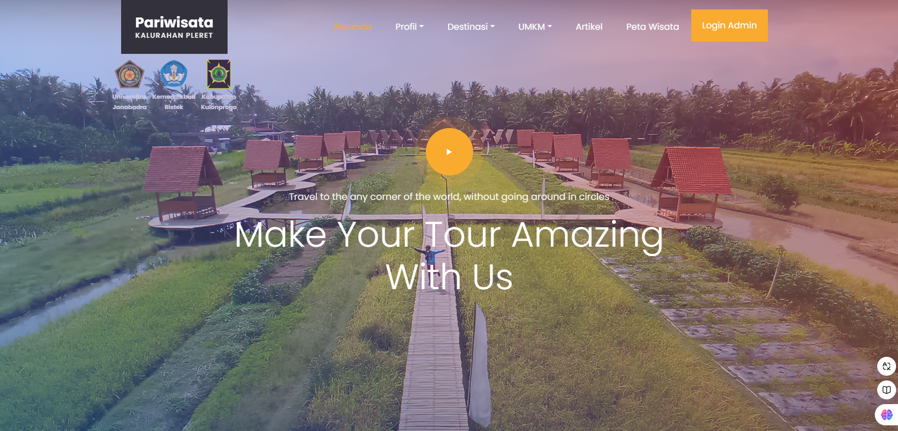
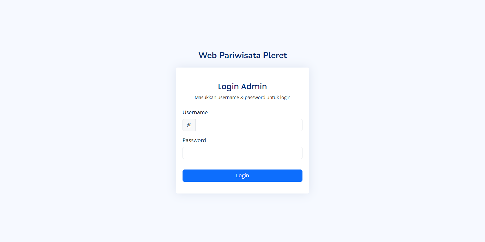
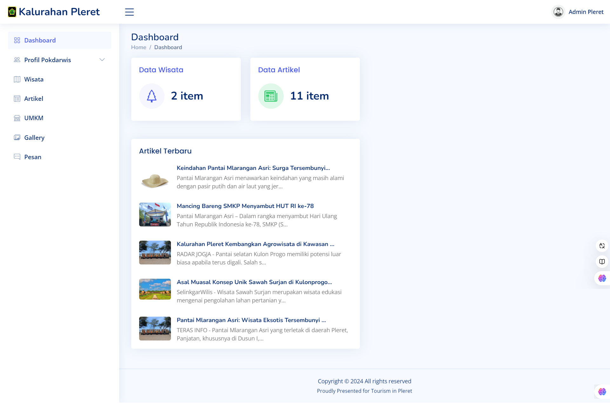
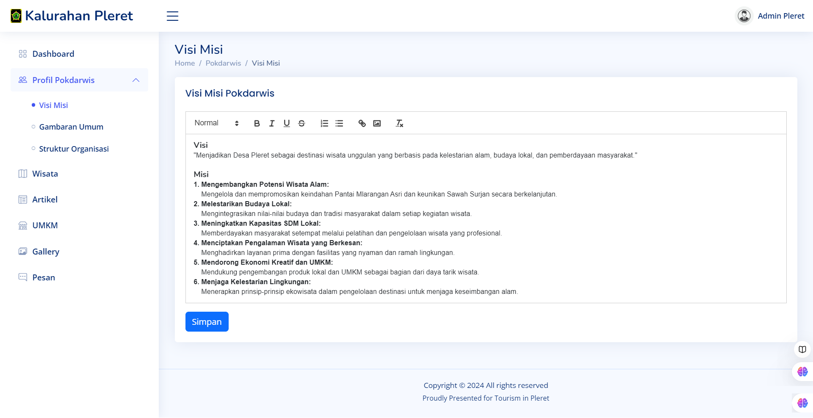
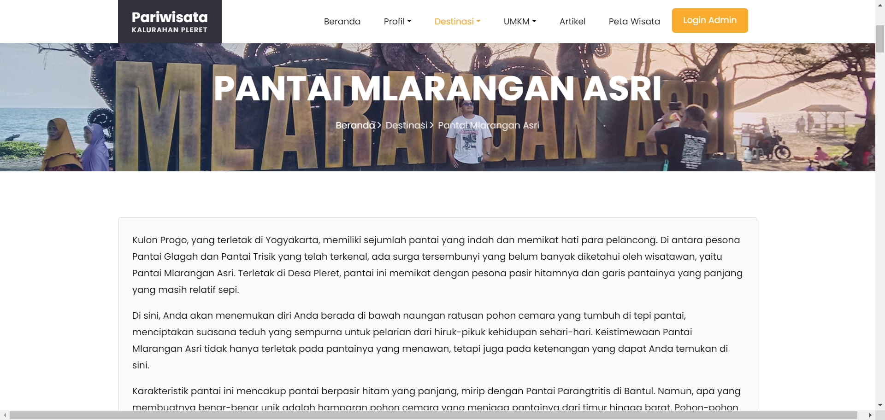
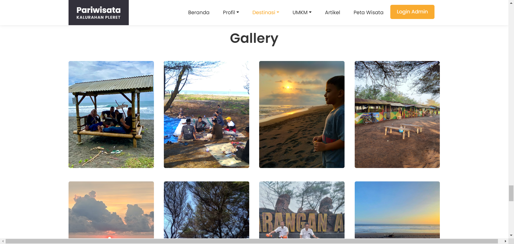
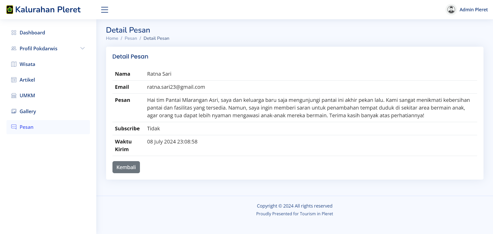
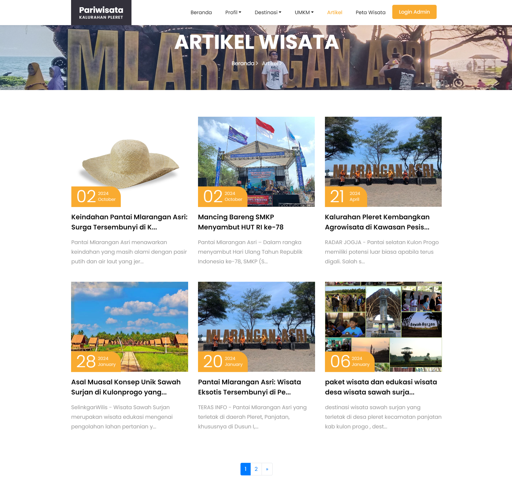
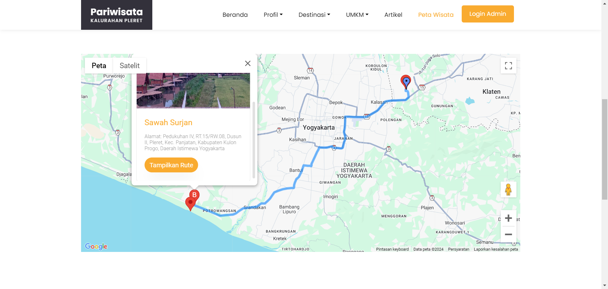

# Web Pariwisata Kalurahan Pleret

## Deskripsi:
Web Pariwisata menyediakan informasi lengkap mengenai tempat wisata, acara, dan kegiatan yang ada di wilayah Pleret. Web dilengkapi dengan SIG menggunakan Google Maps API untuk menyediakan informasi lokasi wisata dan rute menuju lokasi wisata tersebut.

## Teknologi yang digunakan:
* php
* CodeIgniter 4
* Bootstrap
* Google Maps API
* MySQL
* Quilljs text editor

## Fitur:
* Login
* Informasi Wisata
* Informasi Pokdarwis (Kelompok Sadar Wisata)
* Informasi UMKM
* Pesan
* Artikel
* Gallery

## Tampilan:
### Beranda
 

### Login

### Dashboard

### Pokdarwis

### Wisata

### Gallery

### Pesan

### Artikel

### Peta

Selengkapnya:
https://wisata-pleret.com
